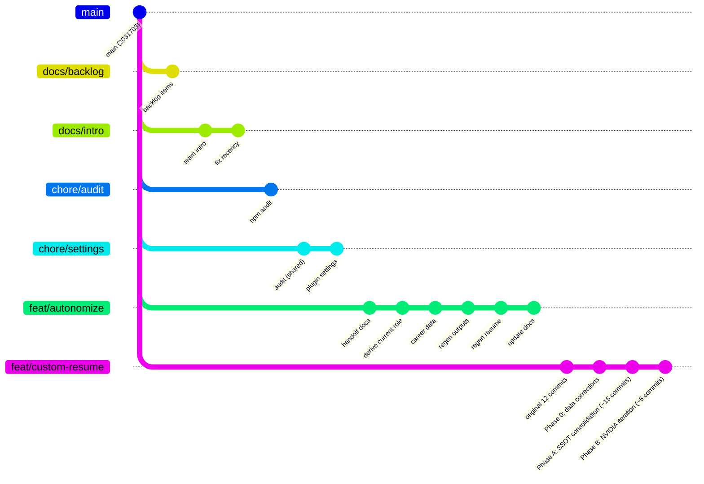
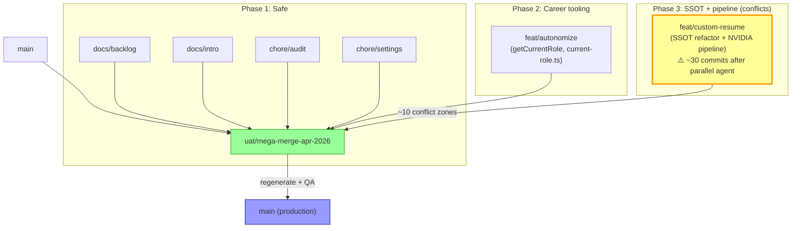
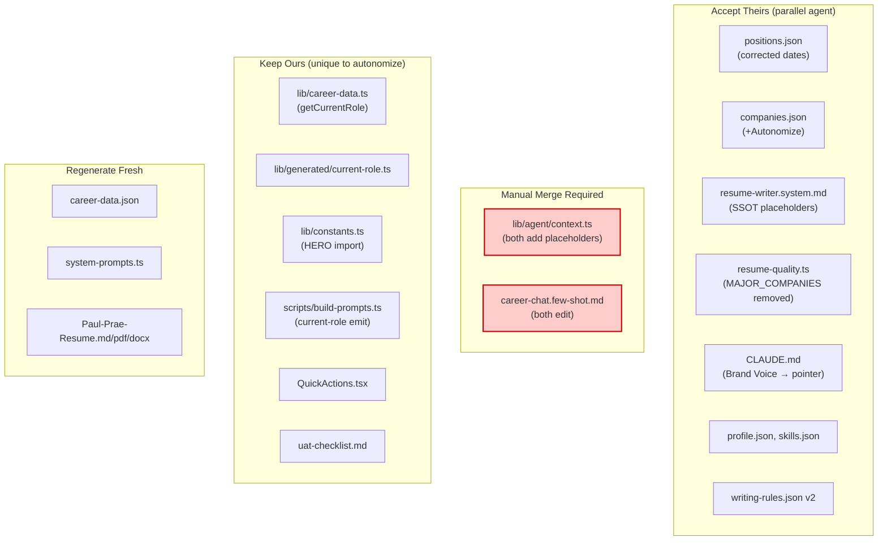

# Mega-Merge Strategy: All Branches → UAT → Production

## Context

paulprae.com has 6 active non-main branches (5 with open PRs) that must be unified into a single UAT branch for holistic testing before production deployment. Paul starts at Autonomize AI on Monday April 13, so the production site must reflect the career transition by then. Simultaneously, NVIDIA tailored content must be preserved and refined.

**Primary objectives (equal priority):**

1. Production site readiness — paulprae.com live, correct, Autonomize-current by Monday
2. NVIDIA tailored content pipeline — preserved, functional, quality-gated

**This plan is designed for execution by Claude Code (Opus, autopilot, ultrathink) with sub-agents.**

**CRITICAL COORDINATION NOTE:** A parallel agent is executing `majestic-gathering-wolf.md` on `feat/custom-resume-gen` RIGHT NOW. That plan has 3 phases (0: data corrections, A: SSOT consolidation, B: NVIDIA iteration) with 55 steps. This mega-merge plan runs AFTER that agent completes its work. The feat/custom-resume-gen branch will be significantly larger than its current 12 commits by merge time.

---

## Pre-Conditions (must be true before executing this plan)

1. The parallel agent on `feat/custom-resume-gen` has completed and pushed all Phase 0 + Phase A + Phase B work
2. `feat/custom-resume-gen` PR #37 is updated with final state
3. All other branches (34, 35, 36, 38) are still open and unmoved

**How to verify:** `git fetch --all && git log --oneline origin/main..origin/feat/custom-resume-gen | wc -l` — should be significantly more than 12 commits (the parallel agent will add ~20-30 commits for Phases 0/A/B).

---

## Ground-Truth Career Timeline (authoritative, from Paul 2026-04-10)

Source: `C:\Users\paulp\.claude\projects\C--dev-paulprae-com\memory\user_career_timeline.md`

| Role                               | Company             | Start        | End          | Notes                                  |
| ---------------------------------- | ------------------- | ------------ | ------------ | -------------------------------------- |
| Chief AI Officer, Founder          | Hyperbloom          | Jan 2020     | **Feb 2025** | Wound down before Arine                |
| Chief AI Architect, Senior Manager | Booz Allen Hamilton | Jul 2024     | Mar 2025     | Overlapped Hyperbloom's final 8 months |
| Staff Data Operations Engineer     | Arine               | **Mar 2025** | **Mar 2026** | NOT Sep 2025 as some files show        |
| Solutions Architect                | Autonomize AI       | **Apr 2026** | Present      | Starts Monday April 13                 |

**WARNING:** My branch (`feat/autonomize-ai-career-update`) used **Sep 2025** for Arine's start date (from Positions.csv). The ground truth is **Mar 2025**. The parallel agent will correct this. During the mega-merge, accept the parallel agent's dates for Arine.

**Modular Earth:** Side project (nonprofit). Transform from position to project per recruiter feedback. The parallel agent's plan describes it as "Out of scope" but my plan includes this transformation.

---

## Updated Conflict Matrix (post-parallel-agent work)

After the parallel agent finishes, `feat/custom-resume-gen` will have modified MANY more files than its current 28. The conflict zones with `feat/autonomize-ai-career-update` expand significantly:

| File                                | My Branch (autonomize)                                    | Parallel Agent (custom-resume)                                                                                             | Resolution                                                                                          |
| ----------------------------------- | --------------------------------------------------------- | -------------------------------------------------------------------------------------------------------------------------- | --------------------------------------------------------------------------------------------------- |
| `positions.json`                    | +Autonomize AI, end-date Arine (Sep 2025→Mar 2026)        | +Autonomize AI (different entry), end-date Arine (Mar 2025→Mar 2026), end-date Hyperbloom (Feb 2025), remove Modular Earth | **Accept parallel agent's version** — has correct dates + Autonomize entry                          |
| `companies.json`                    | +Autonomize AI entry                                      | +Autonomize AI entry (possibly different shape)                                                                            | **Accept parallel agent's**, ensure metrics={} pending Paul's input                                 |
| `resume-writer.system.md`           | +Autonomize AI to differentiators list                    | **Heavy refactor**: inline rules → `{{WRITING_RULES_PROSE}}` placeholders                                                  | **Accept parallel agent's refactor** + manually add Autonomize AI to differentiators if they didn't |
| `resume-quality.ts`                 | +Autonomize AI to MAJOR_COMPANIES                         | **DELETES MAJOR_COMPANIES** entirely, migrates to career data                                                              | **Accept parallel agent's** — my addition is moot                                                   |
| `CLAUDE.md`                         | +Autonomize AI to brand voice list                        | **Replaces Brand Voice block** with pointer to writing-rules.json                                                          | **Accept parallel agent's** — my edit is absorbed                                                   |
| `lib/agent/context.ts`              | +`{{CURRENT_ROLE_SENTENCE}}` placeholder + imports        | +`{{WRITING_RULES_PROSE}}` and 4 other placeholders                                                                        | **Merge both** — different placeholder sets, additive                                               |
| `career-chat.few-shot.md`           | Arine past-tense, `{{CURRENT_ROLE_SENTENCE}}` placeholder | Minor 2-line edit (Neo4j → Ollama)                                                                                         | **Keep both changes** — non-overlapping                                                             |
| `resume-writer.few-shot.md`         | +Autonomize AI in cliches example                         | No changes                                                                                                                 | **Clean merge**                                                                                     |
| `lib/constants.ts`                  | Import CURRENT_ROLE_HERO, derive HERO_DESCRIPTION         | No changes                                                                                                                 | **Clean merge**                                                                                     |
| `lib/career-data.ts`                | +getCurrentRole() helpers (+71 lines)                     | No changes                                                                                                                 | **Clean merge**                                                                                     |
| `lib/generated/current-role.ts`     | New file                                                  | No changes                                                                                                                 | **Clean merge**                                                                                     |
| `scripts/build-prompts.ts`          | +current-role.ts generation                               | No changes (but Phase A3 adds placeholder registration to context.ts)                                                      | **Clean merge**                                                                                     |
| `QuickActions.tsx`                  | Remove "at Arine"                                         | No changes                                                                                                                 | **Clean merge**                                                                                     |
| `uat-checklist.md`                  | Autonomize AI assertions                                  | No changes                                                                                                                 | **Clean merge**                                                                                     |
| `package-lock.json`                 | No changes                                                | +dependencies                                                                                                              | **Regenerate via npm install**                                                                      |
| `lib/prompts/career-chat.system.md` | No changes                                                | Heavily refactored (Phase A4)                                                                                              | **Accept parallel agent's**                                                                         |
| `lib/prompts/job-tools.system.md`   | No changes                                                | Heavily refactored (Phase A4)                                                                                              | **Accept parallel agent's**                                                                         |
| `generate-resume.ts`                | No changes                                                | Validator extracted (Phase A2)                                                                                             | **Accept parallel agent's**                                                                         |
| `lib/tailored.ts`                   | No changes                                                | CRITICAL REMINDERS removed (Phase A5)                                                                                      | **Accept parallel agent's**                                                                         |
| `profile.json`                      | No changes                                                | Email populated, current_role updated                                                                                      | **Accept parallel agent's**                                                                         |
| `skills.json`                       | No changes                                                | Neo4j removed                                                                                                              | **Accept parallel agent's**                                                                         |
| `writing-rules.json`                | No changes                                                | v1 → v2 schema migration                                                                                                   | **Accept parallel agent's**                                                                         |
| `data/generated/career-data.json`   | Regenerated (Autonomize AI current)                       | Regenerated (corrected dates)                                                                                              | **Regenerate fresh after merge**                                                                    |
| `lib/generated/system-prompts.ts`   | Regenerated                                               | Regenerated (with new placeholders)                                                                                        | **Regenerate fresh after merge**                                                                    |

**Key insight:** Most conflicts resolve by **accepting the parallel agent's version**, because their refactor is the target architecture. My branch's contributions that must survive are:

1. `getCurrentRole()` / `getCurrentEmployer()` helpers in `lib/career-data.ts` (new file content, no conflict)
2. `lib/generated/current-role.ts` (new file, no conflict)
3. `scripts/build-prompts.ts` extension (current-role emission, additive)
4. `lib/constants.ts` change (imports from generated file, no conflict)
5. `{{CURRENT_ROLE_SENTENCE}}` placeholder in `lib/agent/context.ts` (additive to parallel agent's placeholders)
6. `QuickActions.tsx` change (employer-agnostic, no conflict)
7. `docs/uat-checklist.md` updates (no conflict)
8. Autonomize AI team intro deliverable (separate file, no conflict)
9. Handoff docs in `.claude/plans/` (separate files, no conflict)

---

## Step 0: Create companion files

Before any git operations, create these two files:

1. **`.claude/plans/merge-strategy-framework.md`** — Copy Appendix A below
2. **`.claude/plans/merge-strategy-analysis.md`** — Copy Appendix B below

Commit both on the UAT branch after creation (Step 1).

---

## Step 1: Create the UAT branch

```bash
# In WSL Ubuntu (~/dev/paulprae-com)
git fetch --all --prune
git checkout main
git pull --ff-only
git checkout -b uat/mega-merge-apr-2026
git push -u origin uat/mega-merge-apr-2026
```

Create companion files from Step 0, commit and push.

---

## Step 2: Phase 1 merges — isolated, zero-conflict branches

### 2.1: docs/backlog-apr4-lighthouse-ux (1 commit, 1 file)

```bash
git tag pre-merge-backlog
git merge origin/docs/backlog-apr4-lighthouse-ux --no-edit
git push
```

### 2.2: docs/autonomize-intro-deliverable (2 commits, 1 file)

```bash
git tag pre-merge-intro
git merge origin/docs/autonomize-intro-deliverable --no-edit
git push
```

### 2.3: chore/audit-fix-and-regen (1 commit)

```bash
git tag pre-merge-audit
git merge origin/chore/audit-fix-and-regen --no-edit
git push
```

### 2.4: chore/add-project-settings (2 commits)

```bash
git tag pre-merge-settings
git merge origin/chore/add-project-settings --no-edit
git push
```

If package-lock.json conflicts: `git checkout --theirs package-lock.json && npm install && git add package-lock.json && git commit --no-edit`

### Phase 1 checkpoint

```bash
npm install && npm test && npm run build
git push
```

---

## Step 3: Phase 2 merge — feat/autonomize-ai-career-update (6 commits, 24 files)

```bash
git tag pre-merge-autonomize
git merge origin/feat/autonomize-ai-career-update --no-edit
git push
```

**Expected:** clean merge — no overlap with Phase 1 branches.

**Post-merge:**

```bash
npm test && npm run build
grep "Autonomize AI" lib/generated/current-role.ts
```

---

## Step 4: Phase 3 merge — feat/custom-resume-gen (EXPANDED, THE HARD ONE)

**By this point, the parallel agent should have completed all 55 steps.** Verify:

```bash
git fetch origin
git log --oneline origin/main..origin/feat/custom-resume-gen | wc -l
# Should be >> 12 (likely 30-40 commits)
```

```bash
git tag pre-merge-custom-resume
git merge origin/feat/custom-resume-gen --no-commit  # CRITICAL: inspect before committing
```

### 4.1: Resolve `data/sources/knowledge/career/positions.json`

**Accept the parallel agent's version** — it has:

- Correct Arine dates (Mar 2025 → Mar 2026, not Sep 2025)
- Correct Hyperbloom dates (Jan 2020 → Feb 2025)
- Autonomize AI entry (with `exclude_from_tailored` flag)
- Modular Earth removed (if they did it; if not, remove it now and add to projects.json)

```bash
git checkout --theirs data/sources/knowledge/career/positions.json
```

Then verify: Autonomize AI is present with `is_current: true`, `start_date: "2026-04"`. If the parallel agent didn't include `exclude_from_tailored`, add it manually.

### 4.2: Resolve `data/sources/knowledge/career/companies.json`

**Accept theirs** — should have Autonomize AI entry.

```bash
git checkout --theirs data/sources/knowledge/career/companies.json
```

### 4.3: Resolve `lib/prompts/resume-writer.system.md`

**Accept theirs** — the parallel agent's Phase A4 refactored this with `{{WRITING_RULES_PROSE}}` placeholders. Then verify "Autonomize AI" appears in the differentiators list. If not, add it:

```bash
git checkout --theirs lib/prompts/resume-writer.system.md
# Then manually verify/add "Autonomize AI" to the key differentiators line
```

### 4.4: Resolve `lib/resume-quality.ts`

**Accept theirs** — MAJOR_COMPANIES is removed entirely in Phase A5, migrated to career data. My addition of "Autonomize AI" is moot.

```bash
git checkout --theirs lib/resume-quality.ts
```

### 4.5: Resolve `CLAUDE.md`

**Accept theirs** — Brand Voice block replaced with pointer. Then verify the pointer is correct and the reduced CLAUDE.md still references Autonomize AI where needed.

```bash
git checkout --theirs CLAUDE.md
```

### 4.6: Resolve `lib/agent/context.ts`

**This one needs manual merge.** Both branches add to the same function:

- My branch: `{{CURRENT_ROLE_SENTENCE}}`, `{{CURRENT_ROLE_HERO}}`, `{{CURRENT_EMPLOYER}}` + imports from `career-data.ts`
- Parallel agent: `{{WRITING_RULES_PROSE}}`, `{{ACTION_VERBS}}`, `{{FORMAT_RULES_PROSE}}`, `{{SUPPRESSED_SKILLS}}`, `{{PHRASE_BLOCKLIST_PROSE}}` + imports from `hydrate-rules.ts`

**Resolution:** Accept theirs as base, then manually add:

1. The imports: `formatCurrentRoleSentence`, `formatCurrentRoleHero`, `getCurrentEmployer` from `../career-data`
2. The 3 placeholder substitutions for current-role in the `buildSystemPrompt` function
3. The 3 lines deriving `currentRoleSentence`, `currentRoleHero`, `currentEmployer` from `context.careerData`

### 4.7: Resolve `lib/prompts/career-chat.few-shot.md`

Both branches edited this. My branch: Arine past-tense + `{{CURRENT_ROLE_SENTENCE}}` placeholder. Parallel agent: minor "Neo4j → Ollama" change.

**Resolution:** Keep all changes from both. The `{{CURRENT_ROLE_SENTENCE}}` placeholder and past-tense Arine from my branch must survive. The Neo4j→Ollama change from theirs should also apply.

### 4.8: Resolve auto-generated files

Accept either side — they'll be regenerated:

```bash
# Accept theirs for all generated files
git checkout --theirs data/generated/career-data.json lib/generated/system-prompts.ts
# current-role.ts is from MY branch only, keep ours
git checkout --ours lib/generated/current-role.ts
```

### 4.9: Resolve `package-lock.json`

```bash
git checkout --theirs package-lock.json
npm install
git add package-lock.json
```

### 4.10: Non-conflict files to review for semantic consistency

After resolving all conflicts, review these for coherence:

- `data/sources/knowledge/career/profile.json` — should have correct email, current_role reflecting Autonomize
- `data/sources/knowledge/career/skills.json` — Neo4j removed, suppress list respected
- `tests/generate.test.ts` — updated assertions for writing_rules reference
- New test files from parallel agent: `tests/data-consistency.test.ts`, `tests/writing-rules.test.ts`, etc.

### 4.11: Handle Modular Earth transformation

If the parallel agent did NOT transform Modular Earth from position to project:

1. Confirm Modular Earth is NOT in `positions.json` (parallel agent should have removed it)
2. Check `data/sources/knowledge/career/projects.json` — add Modular Earth as a project entry:
   ```json
   {
     "title": "Modular Earth",
     "description": "Not-for-profit organization building free, open-source AI agents to help working-class entrepreneurs generate wealth.",
     "url": "https://github.com/Modular-Earth-LLC",
     "startDate": "2022-12"
   }
   ```

### 4.12: Fix Positions.csv (local, gitignored but needed for ingest)

The LinkedIn Positions.csv needs correction for ground-truth dates:

```bash
# In WSL, update Arine's start date from "Sep 2025" to "Mar 2025"
python3 -c "
import csv
rows = []
with open('data/sources/linkedin/Positions.csv', newline='') as f:
    reader = csv.DictReader(f)
    fieldnames = reader.fieldnames
    for row in reader:
        if row['Company Name'] == 'Arine':
            row['Started On'] = 'Mar 2025'
        rows.append(row)
with open('data/sources/linkedin/Positions.csv', 'w', newline='') as f:
    writer = csv.DictWriter(f, fieldnames=fieldnames)
    writer.writeheader()
    writer.writerows(rows)
print('Fixed Arine start date to Mar 2025')
"
```

### 4.13: Commit the merge

```bash
git add -A
git status  # VERIFY: no unexpected files, all conflicts resolved
git commit -m "feat: merge custom-resume-gen pipeline + SSOT refactor

Semantic conflict resolution:
- positions.json: accept parallel agent's corrected dates (Arine Mar 2025,
  Hyperbloom Feb 2025) + Autonomize AI entry with exclude_from_tailored
- resume-writer.system.md: accept SSOT refactor (placeholder hydration),
  verify Autonomize AI in differentiators
- resume-quality.ts: accept MAJOR_COMPANIES removal (migrated to career data)
- CLAUDE.md: accept Brand Voice pointer replacement
- lib/agent/context.ts: manually merged both branches' placeholder additions
  (current-role from autonomize + writing-rules from custom-resume)
- career-chat.few-shot.md: kept CURRENT_ROLE_SENTENCE placeholder + past-tense
  Arine + Ollama example change
- Modular Earth transformed from position to project entry

Co-Authored-By: Claude Opus 4.6 (1M context) <noreply@anthropic.com>"
git push
```

---

## Step 5: Post-merge regeneration

```bash
npm run ingest -- --force          # Rebuild career-data.json from corrected CSV + knowledge
npm run build:prompts              # Regenerate system-prompts.ts + current-role.ts
npm run check:quick                # Validate JSON + hashes
```

**Verify current-role derivation:**

```bash
cat lib/generated/current-role.ts
# MUST show: CURRENT_EMPLOYER = "Autonomize AI"
# MUST show: CURRENT_ROLE_TITLE = "Solutions Architect"
```

**Run tests:**

```bash
npm test                           # All tests (including new data-consistency + writing-rules tests)
npm run build                      # TypeScript + Next.js
```

**Commit regenerated outputs:**

```bash
git add -u && git add data/generated/ lib/generated/ public/
git commit -m "chore: regenerate all pipeline outputs after mega-merge"
git push
```

---

## Step 6: Semantic cleanup pass

### 6.1: Verify skill suppression is SSOT-only

- `data/sources/knowledge/content/writing-rules.json` → `data.suppress_from_output.skills` should be the ONLY location
- Grep for hardcoded suppress lists: `grep -rn "dbt\|LangChain\|n8n" lib/ scripts/ --include="*.ts" | grep -v node_modules | grep -v generated`
- If duplicates found in `lib/tailored.ts` or `scripts/grade-content.ts`, they should import from `lib/writing-rules.ts` instead

### 6.2: Verify Modular Earth is a project, not a position

- `grep -l "Modular Earth" data/sources/knowledge/career/positions.json` should return nothing
- `grep -l "Modular Earth" data/sources/knowledge/career/projects.json` should return the file

### 6.3: Verify Hyperbloom is end-dated

- Check positions.json: `end_date: "2025-02"`, `is_current: false`

### 6.4: Remove .npmrc if present (Windows-specific cache path)

```bash
test -f .npmrc && rm .npmrc && git add .npmrc
```

### 6.5: Dead code scan + lint

```bash
npm run lint 2>&1 | head -50
```

### 6.6: Commit cleanup

```bash
git add -u
git commit -m "chore: post-merge cohesion cleanup"
git push
```

---

## Step 7: Resume regeneration (expensive — do once on final merged state)

```bash
# General resume (~$3.70 per run)
npm run generate -- --force
npm run approve               # Interactive: type 'y'
npm run export -- --force

# NVIDIA tailored resume
npm run generate:tailored -- nvidia --force
npm run generate:cover-letter -- nvidia --force

# Grade both
npx tsx scripts/grade-content.ts data/generated/tailored/Paul-Prae-Resume-NVIDIA.md
npx tsx scripts/grade-content.ts data/generated/tailored/Paul-Prae-Cover-Letter-NVIDIA.md
```

**Commit all generated outputs:**

```bash
git add -u && git add data/generated/ public/
git commit -m "feat: regenerate all resumes on final merged state"
git push
```

---

## Step 8: Full QA

### 8.1: Automated checks

```bash
npm run check                    # Full release checklist
npm test                         # All tests
npm run build                    # TypeScript + Next.js
npm run validate:docs            # Documentation links
```

### 8.2: Resume content review

Read `data/generated/Paul-Prae-Resume.md` end-to-end:

- [ ] Autonomize AI first position with "Apr 2026 – Present"
- [ ] Arine past tense with "Mar 2025 – Mar 2026" (NOT Sep 2025)
- [ ] Hyperbloom past tense with "Jan 2020 – Feb 2025" (NOT Sep 2025)
- [ ] Professional summary says "13+ years" (not 15)
- [ ] Modular Earth in Projects section (not Professional Experience)
- [ ] No suppressed technologies (dbt, LangChain, n8n, Rust, Neo4j)
- [ ] All bullets start with action verbs

### 8.3: NVIDIA tailored content review

- [ ] Arine past tense throughout
- [ ] No suppressed technologies
- [ ] Autonomize AI NOT in NVIDIA resume (exclude_from_tailored)
- [ ] Quality scores: resume ≥ 95%, cover letter ≥ 92%

### 8.4: Local smoke test

```bash
npm run dev
```

- [ ] Hero: "Currently Solutions Architect at Autonomize AI"
- [ ] Chat: "Where do you work now?" → Autonomize AI
- [ ] Chat: "Tell me about Arine" → past tense, Mar 2025 – Mar 2026
- [ ] `/resume` — Autonomize AI first position
- [ ] PDF download works

### 8.5: Vercel preview

```bash
/home/praeducer/.local/bin/gh pr create --base main --head uat/mega-merge-apr-2026 \
  --title "feat: mega-merge — Autonomize transition + tailored pipeline + SSOT refactor" \
  --body "UAT branch combining all 6 feature/chore/doc branches. Full SSOT consolidation, career date corrections, and NVIDIA tailored content pipeline."
```

- [ ] Preview URL loads
- [ ] Chat works
- [ ] Resume downloads work

---

## Step 9: Merge to main + deploy (Sunday April 12 or later)

```bash
/home/praeducer/.local/bin/gh pr merge <PR_NUMBER> --merge
```

Post-deploy verification against `docs/uat-checklist.md`.

---

## Step 10: Clean up stale branches

After verified production deployment:

```bash
for branch in docs/backlog-apr4-lighthouse-ux docs/autonomize-intro-deliverable \
  chore/audit-fix-and-regen chore/add-project-settings \
  feat/autonomize-ai-career-update feat/custom-resume-gen; do
  git push origin --delete "$branch"
done
```

---

## Key decisions log

| Decision                                           | Rationale                                                                                                        |
| -------------------------------------------------- | ---------------------------------------------------------------------------------------------------------------- |
| Run AFTER parallel agent completes                 | Their Phase A refactors the architecture; merging before would create double-work                                |
| Accept parallel agent's version for most conflicts | They have the target architecture (SSOT, correct dates, placeholder hydration)                                   |
| Manual merge only for `lib/agent/context.ts`       | Only file where both branches add genuinely different functionality (current-role vs writing-rules placeholders) |
| Arine start date: Mar 2025 (not Sep 2025)          | Ground truth from Paul, confirmed 2026-04-10 in user_career_timeline.md                                          |
| Hyperbloom end date: Feb 2025                      | Same source — corrections from parallel agent's Phase 0                                                          |
| Transform Modular Earth to project                 | Recruiter feedback: side projects shouldn't be listed as positions                                               |
| Delete .npmrc                                      | Windows-specific cache path breaks cross-platform                                                                |
| Regenerate resume ONCE on final merged state       | $3.70/run, only worthwhile on the fully-merged, fully-corrected data                                             |

---

## Guardrails for executing agent

1. **Commit and push after EVERY step.** Never batch. If the machine crashes, the branch must be recoverable from GitHub.
2. **Never `git push --force` or `git reset --hard`.** No history rewriting. Ever.
3. **Tag before every merge:** `git tag pre-merge-BRANCHNAME`. Recovery without data loss.
4. **Run `npm test` after every merge.** Stop if tests fail.
5. **Do NOT run `npm run generate` until Step 7.** The AI generation is $3.70/run and should only run on the final merged state.
6. **All git push must use SSH** (remote: `git@github.com:praeducer/paulprae-com.git`). HTTPS credential helper fails in WSL.
7. **Positions.csv is gitignored** — exists in WSL only. Fix dates there before running ingest.
8. **Ground-truth dates are in `user_career_timeline.md` memory file.** If any position dates conflict, defer to that file.
9. **The parallel agent's plan (`majestic-gathering-wolf.md`) is the authority** on writing-rules.json schema, prompt hydration architecture, and NVIDIA content quality. Defer to it for those domains.
10. **This plan's unique contributions** are: `getCurrentRole()` derivation system, `lib/generated/current-role.ts`, HERO_DESCRIPTION derivation, `{{CURRENT_ROLE_SENTENCE}}` placeholder, Modular Earth → project transformation, and the merge orchestration itself.

---

## Appendix A: Merge Strategy Framework

_(Save as `.claude/plans/merge-strategy-framework.md`)_

### Multi-Branch Merge Decision Framework

#### 1. Branch Classification

| Risk         | Criteria                                                               |
| ------------ | ---------------------------------------------------------------------- |
| **SAFE**     | Documentation only, config only, no code/data changes                  |
| **LOW**      | Dependency updates, linting, isolated code with no shared-file overlap |
| **MEDIUM**   | Feature code touching shared files in non-overlapping regions          |
| **HIGH**     | Feature code modifying the same lines/functions as another branch      |
| **CRITICAL** | Architectural refactors that change how shared code is consumed        |

#### 2. Merge Order Algorithm

```
1. Sort branches by risk level (SAFE first, CRITICAL last)
2. Within same risk: fewer files → fewer lines → fewer commits first
3. Dependency rule: if Branch A modifies a file Branch B depends on, A before B
4. Semantic rule: additions before deletions (safer conflict resolution)
5. Architecture rule: if Branch X refactors a system that Branch Y edits inline,
   merge Y BEFORE X (so X's refactor absorbs Y's edits cleanly)
```

#### 3. Conflict Resolution Protocol

```
Auto-generated files (package-lock.json, *.generated.ts):
  → Accept either side, regenerate, commit

Structured data (JSON):
  → Parse both → apply all adds + removes → verify structure

Source code (TypeScript):
  → Read full function context → understand INTENT → write NEW code for both

Prompts/markdown:
  → Prefer DRY version (references shared data vs duplicating)
  → Prefer more current data references
  → For overlapping sections: version with target architecture wins

WHEN ONE BRANCH HAS THE TARGET ARCHITECTURE:
  → Accept that branch's version as base
  → Manually layer the other branch's unique contributions on top
  → This is the "accept theirs + patch ours" pattern
```

#### 4. Validation Gates (after each merge)

```
Gate 1: npm install
Gate 2: npm run check:quick
Gate 3: npm test
Gate 4: npm run build
Gate 5: npm run check (full, before final PR)
```

#### 5. Rollback Protocol

```bash
# Before each merge:
git tag pre-merge-BRANCHNAME

# If merge in progress goes wrong:
git merge --abort

# If already committed but not pushed:
git reset --hard pre-merge-BRANCHNAME

# If already pushed:
git revert -m 1 HEAD
```

---

## Appendix B: Merge Strategy Analysis

_(Save as `.claude/plans/merge-strategy-analysis.md`)_

### Branch Topology (post-parallel-agent)



### Merge Sequence



### Conflict Resolution Matrix



### Branch Statistics (updated)

| Branch             | Commits | Risk         | Merge Order    | Conflict Strategy                |
| ------------------ | ------- | ------------ | -------------- | -------------------------------- |
| docs/backlog       | 1       | SAFE         | 1st            | Clean                            |
| docs/intro         | 2       | SAFE         | 2nd            | Clean                            |
| chore/audit        | 1       | LOW          | 3rd            | Clean                            |
| chore/settings     | 2       | LOW          | 4th            | pkg-lock only                    |
| feat/autonomize    | 6       | MEDIUM       | 5th            | Clean                            |
| feat/custom-resume | ~30+    | **CRITICAL** | **6th (last)** | Accept theirs + patch context.ts |

### Post-Merge Capabilities

**From feat/autonomize-ai-career-update:**

- Derived current-role (no hardcoded employer names)
- `lib/generated/current-role.ts` (build-time constants)
- `{{CURRENT_ROLE_SENTENCE}}` placeholder in chat prompts

**From feat/custom-resume-gen (after parallel agent):**

- Writing Rules SSOT v2 (`writing-rules.json` + `lib/writing-rules.ts`)
- Prompt hydration system (`lib/prompts/hydrate-rules.ts`)
- Resume validator (`lib/resume-validator.ts`)
- Tailored resume pipeline (`npm run generate:tailored`)
- Cover letter pipeline (`npm run generate:cover-letter`)
- LLM-as-judge grader (`npm run grade`)
- NVIDIA submission-ready resume + cover letter
- Data consistency tests

**Removed (cleaned up):**

- Hardcoded "Arine" strings
- Inline grounding rules in all 4 system prompts
- MAJOR_COMPANIES constant (migrated to career data)
- Modular Earth from positions (→ projects)
- Neo4j from skills
- Duplicate rule lists across prompts/code
