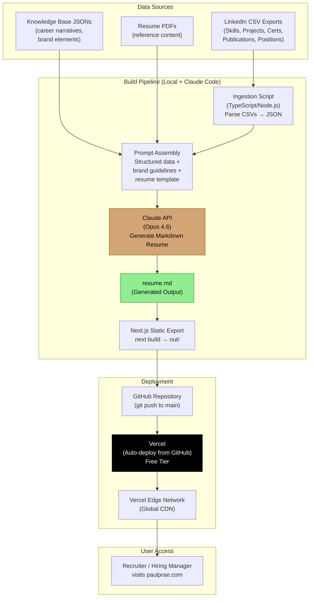
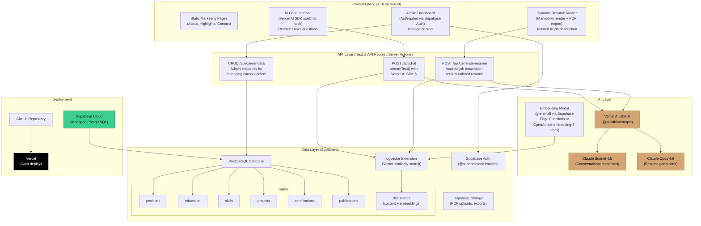

# Technical Design Document: paulprae.com — AI-Powered Career Platform

**Author:** Paul Prae & Claude (Anthropic)
**Version:** 1.0
**Date:** February 24, 2026
**Status:** Ready for Implementation

---

## Table of Contents

1. [Business Objectives](#1-business-objectives)
2. [Technical Requirements](#2-technical-requirements)
3. [Data Sources & Schema](#3-data-sources--schema)
4. [Solution Architecture — Three Phases](#4-solution-architecture--three-phases)
5. [Phase 1: MVP — AI-Generated Static Resume](#5-phase-1-mvp--ai-generated-static-resume)
6. [Phase 2: Full-Stack Interactive Career Platform](#6-phase-2-full-stack-interactive-career-platform)
7. [Phase 3: Knowledge-Graph-Augmented AI Platform](#7-phase-3-knowledge-graph-augmented-ai-platform)
8. [Technical Project Plan](#8-technical-project-plan)
9. [Claude Code Initialization Prompt](#9-claude-code-initialization-prompt)
10. [References](#10-references)

---

## 1. Business Objectives

### Primary Goal

Build and deploy a personal professional website at **paulprae.com** that positions Paul Prae as a Principal AI Engineer & Architect to land a senior engineering leadership or solutions architect role paying $225k+ at a major technology company or well-funded AI startup.

### Success Criteria

| Metric | Target | Timeframe |
|--------|--------|-----------|
| Site live with AI-generated resume | Deployed and shareable | 1 week from start |
| Full interactive platform live | Chat interface + dynamic resume | 4–6 weeks from start |
| Interview conversion rate | Resume link → interview callback | Ongoing measurement |
| Lighthouse performance scores | 90+ across all categories | Phase 2 launch |

### Target Audience

- **Hiring managers** at NVIDIA, Microsoft, AWS, Google, Anthropic, Perplexity, Cursor, Mistral
- **Technical recruiters** screening for senior AI/ML engineering and solutions architect roles
- **Engineering directors** evaluating leadership candidates for their organizations

### Business Constraints

- **Timeline:** Paul is actively job searching — every day without a live site is a missed opportunity
- **Budget:** Free-tier infrastructure initially (Vercel free, Supabase free)
- **Team:** Paul + Claude Code (AI-assisted development) + one frontend reviewer/fixer
- **Content:** LinkedIn data exports are the primary structured data source, supplemented by manually authored career narratives

---

## 2. Technical Requirements

### Functional Requirements

| ID | Requirement | Phase |
|----|-------------|-------|
| FR-1 | Ingest LinkedIn CSV export data (Skills, Projects, Publications, Certifications, Positions, Education) and generate a professional Markdown resume using Claude | 1 |
| FR-2 | Render the Markdown resume as a styled, responsive single-page static site | 1 |
| FR-3 | Deploy automatically to Vercel on every `git push` to `main` | 1 |
| FR-4 | Store all career data in a structured PostgreSQL database via Supabase | 2 |
| FR-5 | Provide an AI conversational interface (chat) where recruiters can ask questions about Paul's career | 2 |
| FR-6 | Generate dynamic resumes tailored to a specific job description and company using RAG over career data | 2 |
| FR-7 | Support PDF export of generated resumes | 2 |
| FR-8 | Admin interface (auth-gated) for managing career content | 2 |
| FR-9 | Knowledge graph of career relationships (skills → projects → roles → outcomes) via Neo4j | 3 |
| FR-10 | Automated data pipelines via n8n for ingestion, embedding generation, and content updates | 3 |

### Non-Functional Requirements

| ID | Requirement | Target |
|----|-------------|--------|
| NFR-1 | Page load time (Largest Contentful Paint) | < 2.5 seconds |
| NFR-2 | Lighthouse scores (Performance, Accessibility, Best Practices, SEO) | 90+ each |
| NFR-3 | Mobile responsiveness | Fully responsive from 320px width |
| NFR-4 | Accessibility | WCAG 2.1 AA compliant |
| NFR-5 | Availability | 99.9% (Vercel + Supabase SLAs) |
| NFR-6 | Cost | $0/month through Phase 1; < $25/month in Phase 2 (API costs only) |
| NFR-7 | Security | No PII exposure; admin routes auth-gated; API keys server-side only |

### Technology Stack (Locked)

| Layer | Technology | Version (Feb 2026) |
|-------|-----------|-------------------|
| **Framework** | Next.js (App Router, TypeScript, Turbopack) | 16.1.6 |
| **UI Components** | shadcn/ui (Radix UI primitives, Tailwind CSS) | CLI 3.0+ |
| **Styling** | Tailwind CSS | 4.x |
| **AI SDK** | Vercel AI SDK | 6.0.97 |
| **LLM** | Anthropic Claude (Opus 4.6 for generation, Sonnet 4.5 for chat) | Current |
| **Database** | Supabase (PostgreSQL + pgvector) | Latest cloud |
| **Auth** | Supabase Auth (@supabase/ssr) | Latest |
| **Deployment** | Vercel | Free tier |
| **Dev Tooling** | Claude Code CLI + Cursor | Latest |
| **Knowledge Graph** (Phase 3) | Neo4j AuraDB | 2026.01+ |
| **Workflow Automation** (Phase 3) | n8n (self-hosted or cloud) | Latest |

---

## 3. Data Sources & Schema

### LinkedIn Data Export Files

Paul's confirmed LinkedIn data export CSVs serve as the primary structured data source. The following files are available and have been validated:

| File | Columns | Row Count | Purpose |
|------|---------|-----------|---------|
| `Skills.csv` | Name | 63 | Technical and professional skills |
| `Projects.csv` | Title, Description, Url, Started On, Finished On | 28 | Portfolio projects with descriptions |
| `Publications.csv` | Name, Published On, Description, Publisher, Url | 2 | Academic and professional publications |
| `Certifications.csv` | Name, Url, Authority, Started On, Finished On, License Number | 10 | Professional certifications (AWS, edX, etc.) |

### Additional LinkedIn Export Files (from full data export)

These are expected when Paul requests a complete LinkedIn data archive:

| File | Expected Columns | Purpose |
|------|-----------------|---------|
| `Positions.csv` | Company Name, Title, Description, Location, Started On, Finished On | Employment history |
| `Education.csv` | School Name, Degree Name, Notes, Started On, Finished On, Activities | Education background |
| `Profile.csv` | First Name, Last Name, Headline, Summary, Industry, Geo Location | Profile metadata |
| `Recommendations_Received.csv` | Recommender, Text, Date, Status | Endorsements and recommendations |
| `Connections.csv` | First Name, Last Name, Email, Company, Position, Connected On | Network (for analytics, not displayed) |

### Supplementary Data Sources

| Source | Format | Content |
|--------|--------|---------|
| `paul_prae_knowledge_base.json` | JSON | Comprehensive career narrative, skills taxonomy, project details, recommendations, personal brand elements |
| `job_search_knowledge_base.json` | JSON | Career objectives, go-to-market strategy, personal brand, target companies |
| `Paul_Prae_Resume_2026.1.pdf` | PDF | Current formatted resume (reference for content and structure) |
| `PaulPrae_Resume_Google_Drive.pdf` | PDF | Detailed resume with project descriptions (reference for rich content) |
| Cover letter files (`.txt`) | Text | Tailored narratives for specific roles/companies |

### Data Pipeline Strategy

LinkedIn CSV exports provide structured skeleton data (titles, dates, company names). The knowledge base JSONs and resume PDFs contain the rich narrative content (project descriptions, quantified outcomes, leadership stories). The AI generation step merges both sources to produce a resume that is structurally accurate and narratively compelling.

---

## 4. Solution Architecture — Three Phases

The following three diagrams show the progressive evolution of the system from MVP to full platform.

### Phase 1 Architecture: AI-Generated Static Resume



**Phase 1 Stack Summary:**

| Layer | Implementation |
|-------|---------------|
| **Frontend** | Next.js 16 static export, single page, Tailwind CSS, responsive layout |
| **Backend** | None (static site) — all generation happens at build time |
| **Data** | Flat files: LinkedIn CSVs + knowledge base JSONs parsed at build time |
| **AI** | Anthropic Claude API called during build to generate Markdown resume |
| **Infrastructure** | Vercel free tier with GitHub auto-deploy; optional custom domain |

---

### Phase 2 Architecture: Full-Stack Interactive Platform



**Phase 2 Stack Summary:**

| Layer | Implementation |
|-------|---------------|
| **Frontend** | Next.js 16 App Router: static marketing pages (SSG), chat interface (client component with `useChat`), dynamic resume viewer (server component with streaming), admin dashboard (auth-gated) |
| **Backend** | Next.js API Routes and Server Actions: chat endpoint using `streamText()`, resume generation endpoint using `generateText()`, CRUD endpoints for career data management |
| **Data** | Supabase PostgreSQL: normalized tables for career data, `documents` table with pgvector embeddings for RAG retrieval. Supabase Auth for admin access. Supabase Storage for file uploads. |
| **AI** | Vercel AI SDK 6 with `@ai-sdk/anthropic` provider: Sonnet 4.5 for chat (fast, cost-effective), Opus 4.6 for resume generation (highest quality). Embedding model for vectorizing career content chunks. RAG pipeline: embed query → pgvector similarity search → retrieve relevant chunks → inject into Claude prompt. |
| **Infrastructure** | Vercel (frontend + API routes), Supabase Cloud (database + auth + storage). GitHub Actions for CI. Custom domain `paulprae.com`. |

---

### Phase 3 Architecture: Knowledge-Graph-Augmented Platform

```mermaid
graph TB
    subgraph "Frontend (Next.js 16 on Vercel)"
        PAGES3["Enhanced Marketing Pages<br/>(Interactive career timeline,<br/>skill visualization)"]
        CHAT3["Advanced AI Chat<br/>(Multi-turn with memory,<br/>graph-powered context)"]
        RESUME3["Intelligent Resume Generator<br/>(Company-specific research,<br/>role-aligned narratives)"]
        ADMIN3["Content Management<br/>(Visual graph editor,<br/>pipeline monitoring)"]
    end

    subgraph "API Layer"
        ORCHESTRATOR["AI Agent Orchestrator<br/>(Vercel AI SDK 6 Agent)<br/>Tool-calling with approval"]
    end

    subgraph "AI Layer"
        AGENT["Claude Agent<br/>(Tool-calling via AI SDK 6)<br/>Decides: search graph,<br/>query vectors, or<br/>fetch web data"]
        CLAUDE_OP3["Claude Opus 4.6<br/>(Complex reasoning)"]
        CLAUDE_SON3["Claude Sonnet 4.5<br/>(Fast responses)"]
        EMBED3["Embedding Pipeline<br/>(Batch + incremental)"]
    end

    subgraph "Knowledge Layer (Neo4j)"
        NEO["Neo4j AuraDB"]
        subgraph "Graph Model"
            N_PERSON["(:Person)"]
            N_ROLE["(:Role)"]
            N_COMPANY["(:Company)"]
            N_PROJECT["(:Project)"]
            N_SKILL["(:Skill)"]
            N_OUTCOME["(:Outcome)"]
            N_CERT["(:Certification)"]
        end
        N_PERSON -->|"HELD_ROLE"| N_ROLE
        N_ROLE -->|"AT_COMPANY"| N_COMPANY
        N_ROLE -->|"DELIVERED"| N_PROJECT
        N_PROJECT -->|"USED_SKILL"| N_SKILL
        N_PROJECT -->|"ACHIEVED"| N_OUTCOME
        N_PERSON -->|"EARNED"| N_CERT
        N_SKILL -->|"APPLIED_IN"| N_PROJECT
    end

    subgraph "Data Layer (Supabase)"
        PG3["PostgreSQL + pgvector<br/>(Operational data +<br/>vector embeddings)"]
        AUTH3["Supabase Auth"]
        STORE3["Supabase Storage"]
    end

    subgraph "Automation Layer (n8n)"
        N8N["n8n Workflow Engine"]
        WF_INGEST["Workflow: LinkedIn Re-ingest<br/>(Watch Storage bucket →<br/>parse CSV → update DB →<br/>sync Neo4j → re-embed)"]
        WF_ENRICH["Workflow: Content Enrichment<br/>(Scrape company news →<br/>update graph →<br/>generate talking points)"]
        WF_MONITOR["Workflow: Site Health<br/>(Check uptime →<br/>alert on errors →<br/>log analytics)"]
    end

    subgraph "External Services"
        WEB["Web Search<br/>(Company research,<br/>job posting analysis)"]
        OLLAMA["Ollama<br/>(Self-hosted LLMs<br/>for local dev/fallback)"]
    end

    subgraph "Infrastructure"
        VCL3["Vercel"]
        SB3["Supabase Cloud"]
        NEO_CLOUD["Neo4j AuraDB Free"]
        N8N_HOST["n8n<br/>(Self-hosted or Cloud)"]
    end

    CHAT3 --> ORCHESTRATOR
    RESUME3 --> ORCHESTRATOR
    ORCHESTRATOR --> AGENT
    AGENT --> CLAUDE_OP3
    AGENT --> CLAUDE_SON3
    AGENT --> NEO
    AGENT --> PG3
    AGENT --> WEB

    N8N --> WF_INGEST
    N8N --> WF_ENRICH
    N8N --> WF_MONITOR
    WF_INGEST --> PG3
    WF_INGEST --> NEO
    WF_ENRICH --> NEO

    EMBED3 --> PG3

    style AGENT fill:#D4A574,stroke:#8B6914,color:#000
    style NEO fill:#008CC1,stroke:#005B82,color:#fff
    style N8N fill:#FF6D5A,stroke:#CC3A27,color:#fff
    style VCL3 fill:#000,stroke:#fff,color:#fff
    style SB3 fill:#3ECF8E,stroke:#1A7F37,color:#000
```



**Phase 3 Stack Summary:**

| Layer | Implementation |
|-------|---------------|
| **Frontend** | Enhanced Next.js 16: interactive career timeline visualization, skill/project relationship explorer, advanced multi-turn chat with memory, company-specific resume customization UI |
| **Backend** | AI Agent orchestration via Vercel AI SDK 6 `Agent` abstraction with tool-calling. Agent decides at runtime whether to query the knowledge graph (Cypher), search vectors (pgvector), or fetch web data for company research. |
| **Data** | Supabase PostgreSQL (operational data + vectors) + Neo4j AuraDB (career knowledge graph). Graph model captures relationships: Person → held Role → at Company → delivered Project → used Skill → achieved Outcome. |
| **AI** | Claude Agent with tools: `queryGraph` (Neo4j Cypher), `searchVectors` (pgvector similarity), `searchWeb` (company/role research). Vercel AI SDK 6 Agent class handles multi-step reasoning and tool approval. Ollama available as a local development fallback. |
| **Automation** | n8n workflows: (1) LinkedIn re-ingest pipeline triggered by file upload to Supabase Storage, (2) company/industry enrichment pipeline that scrapes news and updates the graph, (3) site health monitoring and analytics. |
| **Infrastructure** | Vercel + Supabase Cloud + Neo4j AuraDB Free tier + n8n (self-hosted on a $10/month VPS or n8n Cloud). Future: Rust microservices for performance-critical operations like batch embedding generation. |

---

## 5. Phase 1: MVP — AI-Generated Static Resume

### Objective

Get a live, professional, AI-generated resume at paulprae.com within one week. The resume is generated by Claude from LinkedIn data + knowledge base content, rendered as a styled single-page static site, and auto-deployed to Vercel.

### Architecture Detail

#### 5.1 Data Ingestion Layer

A TypeScript script (`scripts/ingest-linkedin.ts`) that:

1. Reads all LinkedIn CSV files from `data/linkedin/` using `papaparse`
2. Reads supplementary JSON files from `data/knowledge/`
3. Normalizes and merges data into a single `CareerData` TypeScript interface
4. Outputs a unified `data/career-data.json` file

```typescript
// Expected CareerData interface
interface CareerData {
  profile: {
    name: string;
    headline: string;
    summary: string;
    location: string;
    email: string;
    linkedin: string;
    website: string;
  };
  positions: Array<{
    title: string;
    company: string;
    location: string;
    startDate: string;
    endDate: string | null;
    description: string;
    highlights: string[];
  }>;
  education: Array<{
    school: string;
    degree: string;
    field: string;
    startDate: string;
    endDate: string;
    notes: string;
  }>;
  skills: string[];
  certifications: Array<{
    name: string;
    authority: string;
    date: string;
    licenseNumber?: string;
    url?: string;
  }>;
  projects: Array<{
    title: string;
    description: string;
    url?: string;
    startDate: string;
    endDate?: string;
  }>;
  publications: Array<{
    name: string;
    publisher: string;
    date: string;
    url?: string;
    description: string;
  }>;
}
```

#### 5.2 AI Resume Generation Layer

A TypeScript script (`scripts/generate-resume.ts`) that:

1. Loads `data/career-data.json`
2. Constructs a structured prompt with resume formatting instructions, brand voice guidelines, and all career data
3. Calls the Anthropic API (Claude Opus 4.6) via `@anthropic-ai/sdk` to generate a Markdown resume
4. Writes the output to `content/resume.md`
5. Is idempotent and re-runnable — update data, re-run script, get new resume

The prompt will instruct Claude to:
- Structure the resume with clear sections: Summary, Experience, Education, Skills, Certifications, Projects, Publications
- Use Paul's brand voice: confident, technically precise, action-oriented
- Emphasize AI engineering leadership, healthcare domain expertise, and Fortune 500 delivery track record
- Quantify impact where data supports it
- Target the resume toward Principal AI Engineer and Solutions Architect roles
- Keep total length to approximately 2 pages when rendered

#### 5.3 Frontend Layer

A minimal Next.js 16 application with:

- **Single page** (`app/page.tsx`): Server component that reads `content/resume.md` at build time and renders it as styled HTML
- **Markdown rendering**: `react-markdown` with `remark-gfm` for GitHub-flavored Markdown support
- **Styling**: Tailwind CSS with a professional, clean typography system. Custom `prose` class overrides for resume-appropriate spacing, font sizing, and section hierarchy. No shadcn/ui in Phase 1 — it's not needed for a single page.
- **Responsive**: Renders well from 320px mobile to 1440px desktop
- **Meta tags**: Open Graph and Twitter Card metadata for professional link previews when shared
- **Print styles**: CSS `@media print` rules so the page prints cleanly as a PDF from the browser

**Build configuration** (`next.config.ts`):
```typescript
const nextConfig = {
  output: 'export',  // Static HTML export for Phase 1
};
```

#### 5.4 Deployment Layer

- **GitHub**: Push to `main` branch triggers Vercel deployment
- **Vercel**: Connected to GitHub repository, auto-builds on push, serves from global CDN
- **Domain**: Initially served at `paulprae.vercel.app`; custom domain `paulprae.com` added when ready (Vercel supports this in free tier)
- **Build command**: `next build` (produces static `out/` directory)

#### 5.5 Repeatable Pipeline

The entire flow from data to deployed site:

```
1. Export data from LinkedIn → drop CSVs in data/linkedin/
2. Run: npx tsx scripts/ingest-linkedin.ts
3. Run: npx tsx scripts/generate-resume.ts
4. Run: npx tsx scripts/export-resume.ts  (PDF + DOCX)
5. Review content/resume.md, make any manual edits
6. git add . && git commit -m "Update resume" && git push
7. Vercel auto-deploys within ~60 seconds
```

**Full pipeline shortcut:** `npm run pipeline` (runs ingest → generate → export → build sequentially)

This pipeline can be run whenever LinkedIn data changes or when Paul wants to adjust the resume targeting.

#### 5.6 Resume Export Layer (PDF & DOCX)

The export layer converts the AI-generated Markdown resume into recruiter-friendly PDF and DOCX formats using two system-level tools:

- **Pandoc** (MD → DOCX): Industry-standard document converter with 18+ years of active development. Produces native Word documents with proper styles, headings, and ATS-parseable structure.
- **Typst** (MD → PDF via Pandoc intermediate): Modern Rust-based typesetter that produces publication-grade PDF typography. Pandoc converts Markdown to Typst markup, then Typst compiles to PDF using a custom template.

```
Pipeline flow:
  content/resume.md
       |
       +──→ pandoc (MD → DOCX) ──→ out/resume.docx
       |         uses templates/reference.docx for styling
       |
       +──→ pandoc (MD → Typst) → typst compile ──→ out/resume.pdf
                uses templates/resume.typ for styling
```

**System dependencies (not npm packages):**

| Tool | Install | Purpose |
|------|---------|---------|
| Pandoc | `sudo apt-get install -y pandoc` | Markdown → DOCX, Markdown → Typst |
| Typst | `cargo install typst-cli` | Typst → PDF compilation |

**Architecture Decision Record: Pandoc + Typst vs Alternatives**

| Approach | Output Quality | Custom Code | Dependencies | Maintenance |
|----------|---------------|-------------|--------------|-------------|
| **Pandoc + Typst** ✅ | Publication-grade PDF, native DOCX | ~80 lines (1 script) | 2 system binaries, 0 npm | Pandoc: 35k★, Typst: 35k★ |
| Puppeteer / md-to-pdf | Browser-rendered PDF (CSS dependent) | ~60 lines | 1 npm (Chromium ~400MB) | Chromium version churn |
| Node.js docx package | Programmatic DOCX (no PDF) | ~200+ lines | 1 npm | Manual style mapping |
| LaTeX via Pandoc | Gold-standard PDF | ~80 lines + .tex template | texlive (~2GB) | LaTeX ecosystem complexity |

**Future consideration — MCP integration (Phase 2/3):**
The `mcp-pandoc` server by vivekVells could enable Claude agents to trigger format conversion as a tool call during chat (e.g., a "Download as PDF" button in the Phase 2 chat interface). Current tradeoffs:
- Cost: Current approach = $0 (local binaries) vs MCP = server hosting or local process overhead
- Benefit: Enables agent-driven conversion without shell access
- Tradeoff: `mcp-pandoc` is in early development; PDF support still being built
- Recommendation: Adopt in Phase 2 when the chat interface needs on-demand export

---

## 6. Phase 2: Full-Stack Interactive Career Platform

### Objective

Transform the static site into an interactive platform where recruiters can have AI-powered conversations about Paul's career and generate resumes tailored to specific job descriptions.

### Architecture Detail

#### 6.1 Database Schema (Supabase PostgreSQL)

```sql
-- Enable pgvector extension
CREATE EXTENSION IF NOT EXISTS vector;

-- Career data tables (migrated from flat files)
CREATE TABLE positions (
  id UUID PRIMARY KEY DEFAULT gen_random_uuid(),
  company TEXT NOT NULL,
  title TEXT NOT NULL,
  location TEXT,
  start_date DATE NOT NULL,
  end_date DATE,
  description TEXT,
  highlights TEXT[],
  is_current BOOLEAN DEFAULT FALSE,
  sort_order INTEGER,
  created_at TIMESTAMPTZ DEFAULT NOW(),
  updated_at TIMESTAMPTZ DEFAULT NOW()
);

CREATE TABLE education (
  id UUID PRIMARY KEY DEFAULT gen_random_uuid(),
  school TEXT NOT NULL,
  degree TEXT NOT NULL,
  field TEXT,
  start_date DATE,
  end_date DATE,
  notes TEXT,
  gpa TEXT,
  honors TEXT[],
  created_at TIMESTAMPTZ DEFAULT NOW()
);

CREATE TABLE skills (
  id UUID PRIMARY KEY DEFAULT gen_random_uuid(),
  name TEXT NOT NULL UNIQUE,
  category TEXT, -- e.g., 'AI/ML', 'Cloud', 'Leadership', 'Languages'
  proficiency TEXT, -- e.g., 'expert', 'advanced', 'intermediate'
  years_experience INTEGER,
  is_featured BOOLEAN DEFAULT FALSE,
  created_at TIMESTAMPTZ DEFAULT NOW()
);

CREATE TABLE projects (
  id UUID PRIMARY KEY DEFAULT gen_random_uuid(),
  title TEXT NOT NULL,
  description TEXT,
  url TEXT,
  start_date DATE,
  end_date DATE,
  technologies TEXT[],
  outcomes TEXT[],
  position_id UUID REFERENCES positions(id),
  created_at TIMESTAMPTZ DEFAULT NOW()
);

CREATE TABLE certifications (
  id UUID PRIMARY KEY DEFAULT gen_random_uuid(),
  name TEXT NOT NULL,
  authority TEXT NOT NULL,
  issue_date DATE,
  expiry_date DATE,
  license_number TEXT,
  url TEXT,
  created_at TIMESTAMPTZ DEFAULT NOW()
);

CREATE TABLE publications (
  id UUID PRIMARY KEY DEFAULT gen_random_uuid(),
  name TEXT NOT NULL,
  publisher TEXT NOT NULL,
  published_date DATE,
  url TEXT,
  description TEXT,
  created_at TIMESTAMPTZ DEFAULT NOW()
);

-- Vector embeddings for RAG
CREATE TABLE documents (
  id UUID PRIMARY KEY DEFAULT gen_random_uuid(),
  content TEXT NOT NULL,
  metadata JSONB DEFAULT '{}',
  embedding VECTOR(1536), -- Dimension matches embedding model
  source_type TEXT, -- 'position', 'project', 'skill_narrative', 'recommendation', etc.
  source_id UUID, -- References the original record
  created_at TIMESTAMPTZ DEFAULT NOW()
);

-- Index for fast similarity search
CREATE INDEX ON documents USING ivfflat (embedding vector_cosine_ops)
  WITH (lists = 100);

-- Function for similarity search (called via Supabase rpc)
CREATE OR REPLACE FUNCTION match_documents(
  query_embedding VECTOR(1536),
  match_threshold FLOAT DEFAULT 0.7,
  match_count INT DEFAULT 10
)
RETURNS TABLE (
  id UUID,
  content TEXT,
  metadata JSONB,
  similarity FLOAT
)
LANGUAGE plpgsql
AS $$
BEGIN
  RETURN QUERY
  SELECT
    documents.id,
    documents.content,
    documents.metadata,
    1 - (documents.embedding <=> query_embedding) AS similarity
  FROM documents
  WHERE 1 - (documents.embedding <=> query_embedding) > match_threshold
  ORDER BY documents.embedding <=> query_embedding
  LIMIT match_count;
END;
$$;

-- Row-level security
ALTER TABLE positions ENABLE ROW LEVEL SECURITY;
ALTER TABLE education ENABLE ROW LEVEL SECURITY;
ALTER TABLE skills ENABLE ROW LEVEL SECURITY;
ALTER TABLE projects ENABLE ROW LEVEL SECURITY;
ALTER TABLE certifications ENABLE ROW LEVEL SECURITY;
ALTER TABLE publications ENABLE ROW LEVEL SECURITY;
ALTER TABLE documents ENABLE ROW LEVEL SECURITY;

-- Public read access (anyone can view career data)
CREATE POLICY "Public read access" ON positions FOR SELECT USING (true);
CREATE POLICY "Public read access" ON education FOR SELECT USING (true);
CREATE POLICY "Public read access" ON skills FOR SELECT USING (true);
CREATE POLICY "Public read access" ON projects FOR SELECT USING (true);
CREATE POLICY "Public read access" ON certifications FOR SELECT USING (true);
CREATE POLICY "Public read access" ON publications FOR SELECT USING (true);
CREATE POLICY "Public read access" ON documents FOR SELECT USING (true);

-- Admin write access (authenticated users only)
CREATE POLICY "Admin write access" ON positions FOR ALL USING (auth.role() = 'authenticated');
CREATE POLICY "Admin write access" ON education FOR ALL USING (auth.role() = 'authenticated');
CREATE POLICY "Admin write access" ON skills FOR ALL USING (auth.role() = 'authenticated');
CREATE POLICY "Admin write access" ON projects FOR ALL USING (auth.role() = 'authenticated');
CREATE POLICY "Admin write access" ON certifications FOR ALL USING (auth.role() = 'authenticated');
CREATE POLICY "Admin write access" ON publications FOR ALL USING (auth.role() = 'authenticated');
CREATE POLICY "Admin write access" ON documents FOR ALL USING (auth.role() = 'authenticated');
```

#### 6.2 AI Chat Interface

**Server-side (`app/api/chat/route.ts`):**

```typescript
import { streamText } from 'ai';
import { anthropic } from '@ai-sdk/anthropic';
import { createClient } from '@/lib/supabase/server';

export async function POST(req: Request) {
  const { messages } = await req.json();
  const supabase = await createClient();

  // Get the latest user message for RAG retrieval
  const lastMessage = messages[messages.length - 1].content;

  // Generate embedding for the query
  const queryEmbedding = await generateEmbedding(lastMessage);

  // Retrieve relevant career context via pgvector
  const { data: relevantDocs } = await supabase.rpc('match_documents', {
    query_embedding: queryEmbedding,
    match_threshold: 0.7,
    match_count: 8,
  });

  const context = relevantDocs?.map(d => d.content).join('\n\n') ?? '';

  const result = streamText({
    model: anthropic('claude-sonnet-4-5-20250514'),
    system: `You are an AI assistant on Paul Prae's professional website.
Your role is to help recruiters and hiring managers learn about Paul's
qualifications, experience, and fit for their open positions.

Use the following career context to answer questions accurately:

${context}

Guidelines:
- Be professional, warm, and confident
- Answer only based on the provided context
- If asked something outside Paul's career data, redirect politely
- Highlight relevant experience that matches the recruiter's interests
- Never fabricate or exaggerate accomplishments`,
    messages,
  });

  return result.toDataStreamResponse();
}
```

**Client-side (`components/chat.tsx`):**

Uses Vercel AI SDK 6's `useChat` hook from `@ai-sdk/react`:

```typescript
import { useChat } from '@ai-sdk/react';

export function Chat() {
  const { messages, input, handleInputChange, handleSubmit, isLoading } = useChat({
    api: '/api/chat',
  });
  // Render chat UI with messages, input field, and send button
}
```

#### 6.3 Dynamic Resume Generation

**Endpoint (`app/api/generate-resume/route.ts`):**

Accepts a job description and company name. Uses RAG to pull the most relevant career content, then calls Claude Opus 4.6 to generate a tailored resume in Markdown format.

```typescript
import { generateText } from 'ai';
import { anthropic } from '@ai-sdk/anthropic';

export async function POST(req: Request) {
  const { jobDescription, companyName } = await req.json();

  // Embed the job description
  const jdEmbedding = await generateEmbedding(jobDescription);

  // Retrieve most relevant career content
  const { data: relevantDocs } = await supabase.rpc('match_documents', {
    query_embedding: jdEmbedding,
    match_threshold: 0.5,
    match_count: 15,
  });

  // Also fetch structured data
  const { data: positions } = await supabase.from('positions').select('*').order('start_date', { ascending: false });
  const { data: skills } = await supabase.from('skills').select('*').eq('is_featured', true);
  const { data: certifications } = await supabase.from('certifications').select('*');

  const result = await generateText({
    model: anthropic('claude-opus-4-6-20250414'),
    prompt: `Generate a professional resume in Markdown for Paul Prae,
tailored specifically for the following position:

Company: ${companyName}
Job Description:
${jobDescription}

Relevant career context:
${relevantDocs?.map(d => d.content).join('\n\n')}

Structured data:
Positions: ${JSON.stringify(positions)}
Featured Skills: ${JSON.stringify(skills)}
Certifications: ${JSON.stringify(certifications)}

Instructions:
- Tailor the summary to directly address the job requirements
- Prioritize and reorder experience sections by relevance to this role
- Highlight skills that match the job description
- Include quantified outcomes where available
- Keep to approximately 2 pages when rendered
- Use professional Markdown formatting`,
  });

  return Response.json({ resume: result.text });
}
```

#### 6.4 Frontend Components

| Component | Type | Purpose |
|-----------|------|---------|
| `app/page.tsx` | Server Component | Landing page with hero, highlights, CTA |
| `app/chat/page.tsx` | Client Component | AI chat interface for recruiters |
| `app/resume/page.tsx` | Client Component | Dynamic resume generator (input JD → get tailored resume) |
| `app/admin/page.tsx` | Server Component (Auth-gated) | Career data management dashboard |
| `components/chat.tsx` | Client Component | Chat UI using `useChat` hook |
| `components/resume-viewer.tsx` | Client Component | Renders Markdown resume with print/PDF button |
| `components/resume-form.tsx` | Client Component | Job description input form |
| `lib/supabase/server.ts` | Utility | Server-side Supabase client with cookie-based auth |
| `lib/supabase/client.ts` | Utility | Client-side Supabase client |

#### 6.5 Embedding Pipeline

A script (`scripts/generate-embeddings.ts`) that:

1. Reads all career data from Supabase
2. Chunks content into semantically meaningful segments (per position, per project, per skill narrative)
3. Generates embeddings via OpenAI `text-embedding-3-small` (1536 dimensions, $0.02/1M tokens) or Supabase Edge Functions with `gte-small` (384 dimensions, free)
4. Upserts into the `documents` table with metadata (source_type, source_id)
5. Is re-runnable for incremental updates

---

## 7. Phase 3: Knowledge-Graph-Augmented AI Platform

### Objective

Elevate the platform's AI capabilities using a knowledge graph to capture rich relationships between career elements, enabling more nuanced and contextually aware responses.

### Architecture Detail

#### 7.1 Neo4j Knowledge Graph Model

```cypher
// Core nodes
(:Person {name: "Paul Prae", headline: "...", summary: "..."})
(:Company {name: "Arine", industry: "Healthcare AI", size: "startup"})
(:Role {title: "Staff Data Operations Engineer", type: "full-time"})
(:Project {name: "AI Agent Platform", description: "...", impact: "..."})
(:Skill {name: "Python", category: "Language", proficiency: "expert"})
(:Outcome {description: "Reduced pipeline failures by 40%", metric_type: "efficiency"})
(:Certification {name: "AWS ML Specialty", authority: "AWS"})
(:Technology {name: "Apache Kafka", category: "streaming"})

// Relationship types
(person)-[:HELD_ROLE {start: date, end: date}]->(role)
(role)-[:AT_COMPANY]->(company)
(role)-[:DELIVERED]->(project)
(project)-[:USED_SKILL]->(skill)
(project)-[:USED_TECHNOLOGY]->(technology)
(project)-[:ACHIEVED]->(outcome)
(person)-[:EARNED {date: date}]->(certification)
(skill)-[:RELATED_TO {strength: 0.8}]->(skill)
(company)-[:IN_INDUSTRY]->(industry)
```

**Why a knowledge graph matters for this use case:**

When a recruiter asks "Tell me about Paul's experience leading AI teams in healthcare," the graph can traverse: Person → HELD_ROLE → Role(containing "lead" or "manager") → AT_COMPANY → Company(industry: "healthcare") → DELIVERED → Project → ACHIEVED → Outcome. This produces more precise, relationship-aware answers than vector similarity alone.

#### 7.2 AI Agent with Tools (Vercel AI SDK 6)

```typescript
import { Agent } from 'ai';
import { anthropic } from '@ai-sdk/anthropic';

const careerAgent = new Agent({
  model: anthropic('claude-opus-4-6-20250414'),
  tools: {
    queryCareerGraph: {
      description: 'Query the Neo4j career knowledge graph using Cypher',
      parameters: z.object({ cypher: z.string() }),
      execute: async ({ cypher }) => {
        const session = neo4jDriver.session();
        const result = await session.run(cypher);
        return result.records.map(r => r.toObject());
      },
    },
    searchCareerContent: {
      description: 'Semantic search over career documents using pgvector',
      parameters: z.object({ query: z.string(), limit: z.number().default(8) }),
      execute: async ({ query, limit }) => {
        const embedding = await generateEmbedding(query);
        const { data } = await supabase.rpc('match_documents', {
          query_embedding: embedding,
          match_count: limit,
        });
        return data;
      },
    },
    researchCompany: {
      description: 'Search the web for current information about a company',
      parameters: z.object({ company: z.string(), topic: z.string() }),
      execute: async ({ company, topic }) => {
        // Web search integration for company research
      },
    },
  },
});
```

#### 7.3 n8n Automation Workflows

| Workflow | Trigger | Actions |
|----------|---------|---------|
| **LinkedIn Re-ingest** | New file uploaded to Supabase Storage `linkedin-exports` bucket | Unzip → parse CSVs → upsert to PostgreSQL → sync to Neo4j → regenerate embeddings → notify via email |
| **Content Enrichment** | Scheduled (weekly) or manual trigger | For each target company in job search config: scrape recent news → extract key themes → update Neo4j graph nodes → generate talking points |
| **Site Health Monitor** | Scheduled (every 6 hours) | Check site uptime → verify API endpoints → log Lighthouse scores → alert on degradation |
| **Resume Version Tracker** | Webhook from resume generation endpoint | Store generated resume version → track which JDs generated which resumes → analytics on tailoring patterns |

---

## 8. Technical Project Plan

### Phase 1: MVP — AI-Generated Static Resume (Days 1–5)

#### Day 1: Project Setup & Data Pipeline

| Task | Description | Tool |
|------|-------------|------|
| 1.1 | Initialize git repo with Next.js 16 boilerplate (see Section 9 for Claude Code prompt) | Claude Code |
| 1.2 | Add LinkedIn CSV files to `data/linkedin/` directory | Manual |
| 1.3 | Add knowledge base JSONs to `data/knowledge/` directory | Manual |
| 1.4 | Build `scripts/ingest-linkedin.ts` — parse all CSVs with PapaParse, merge with knowledge base data, output unified `data/career-data.json` | Claude Code |
| 1.5 | Test ingestion: verify all 63 skills, 28 projects, 10 certifications, 2 publications parse correctly | Claude Code |

#### Day 2: AI Resume Generation

| Task | Description | Tool |
|------|-------------|------|
| 2.1 | Build `scripts/generate-resume.ts` — load career data, construct prompt, call Claude API, write `content/resume.md` | Claude Code |
| 2.2 | Iterate on the prompt until resume quality meets bar: accurate data, strong narrative, professional tone, approximately 2-page length | Claude Code + Manual review |
| 2.3 | Add environment variable handling for `ANTHROPIC_API_KEY` via `.env.local` | Claude Code |

#### Day 3: Static Site Build

| Task | Description | Tool |
|------|-------------|------|
| 3.1 | Build `app/page.tsx` — server component that reads `content/resume.md` and renders styled HTML | Claude Code |
| 3.2 | Configure `react-markdown` with `remark-gfm` for Markdown rendering | Claude Code |
| 3.3 | Style with Tailwind CSS: professional typography, responsive layout, print-friendly CSS | Claude Code |
| 3.4 | Add Open Graph meta tags, favicon, page title | Claude Code |
| 3.5 | Configure `next.config.ts` with `output: 'export'` for static generation | Claude Code |
| 3.6 | Test locally: `npx next build && npx next start` — verify rendering on desktop and mobile viewports | Claude Code |

#### Day 4: Deployment & Domain

| Task | Description | Tool |
|------|-------------|------|
| 4.1 | Connect GitHub repo to Vercel (import project) | Manual (Vercel dashboard) |
| 4.2 | Push to `main` — verify auto-deploy succeeds | Git + Vercel |
| 4.3 | Test live site at `*.vercel.app` URL | Browser |
| 4.4 | (Optional) Add custom domain `paulprae.com` in Vercel dashboard, configure DNS | Manual |
| 4.5 | Verify Lighthouse scores: target 90+ across all categories | Browser DevTools |

#### Day 5: Polish & Pipeline Documentation

| Task | Description | Tool |
|------|-------------|------|
| 5.1 | Write README.md documenting the full pipeline: data export → ingestion → generation → deploy | Claude Code |
| 5.2 | Add npm scripts for the pipeline: `npm run ingest`, `npm run generate`, `npm run deploy` | Claude Code |
| 5.3 | Final QA: cross-browser testing (Chrome, Safari, Firefox), mobile testing, link verification | Manual |
| 5.4 | Create CLAUDE.md for Claude Code project context | Claude Code `/init` |

### Phase 2: Full-Stack Platform (Weeks 2–6)

#### Week 2: Database & Data Migration

| Task | Description |
|------|-------------|
| 2.1 | Create Supabase project, enable pgvector extension |
| 2.2 | Apply database schema (all tables, RLS policies, match_documents function) |
| 2.3 | Build migration script: `scripts/migrate-to-supabase.ts` — reads `career-data.json`, inserts into Supabase tables |
| 2.4 | Build embedding pipeline: `scripts/generate-embeddings.ts` — chunks career content, generates embeddings, stores in `documents` table |
| 2.5 | Verify: query `match_documents` with test queries, confirm relevant results returned |

#### Week 3: AI Chat Backend

| Task | Description |
|------|-------------|
| 3.1 | Remove `output: 'export'` from Next.js config (switch to server-rendered) |
| 3.2 | Install Vercel AI SDK 6: `npm install ai @ai-sdk/anthropic @ai-sdk/react` |
| 3.3 | Build `app/api/chat/route.ts` — RAG-powered chat endpoint with `streamText()` |
| 3.4 | Build `components/chat.tsx` — chat UI with `useChat` hook, message list, input field, typing indicator |
| 3.5 | Build `app/chat/page.tsx` — public chat page with suggested starter questions |
| 3.6 | Test: verify streaming responses, relevant context retrieval, professional tone |

#### Week 4: Dynamic Resume Generation

| Task | Description |
|------|-------------|
| 4.1 | Build `app/api/generate-resume/route.ts` — accepts JD, returns tailored resume |
| 4.2 | Build `components/resume-form.tsx` — job description input with company name field |
| 4.3 | Build `components/resume-viewer.tsx` — renders generated Markdown resume with styled typography |
| 4.4 | Add PDF export: client-side print-to-PDF or server-side via Puppeteer/`md-to-pdf` |
| 4.5 | Build `app/resume/page.tsx` — public page combining form and viewer |

#### Week 5: Static Pages & Admin

| Task | Description |
|------|-------------|
| 5.1 | Build static marketing pages: landing (`app/page.tsx`), about, highlights |
| 5.2 | Configure Supabase Auth (email/password for admin only) |
| 5.3 | Build `app/admin/page.tsx` — CRUD interface for career data (basic forms, not elaborate) |
| 5.4 | SEO: sitemap.xml, robots.txt, structured data (JSON-LD for Person schema) |
| 5.5 | Set Vercel environment variables for production: `ANTHROPIC_API_KEY`, `NEXT_PUBLIC_SUPABASE_URL`, `SUPABASE_SERVICE_ROLE_KEY` |

#### Week 6: Frontend Review & Polish

| Task | Description |
|------|-------------|
| 6.1 | Send to frontend developer for review (per Frontend Developer Guide) |
| 6.2 | Address accessibility issues: ARIA labels, keyboard navigation, screen reader support, heading hierarchy |
| 6.3 | Address visual distinctiveness: typography refinement, spacing, color system, visual hierarchy |
| 6.4 | Streaming UX polish: auto-scroll behavior, Markdown rendering mid-stream, typing indicators |
| 6.5 | Responsive testing: verify chat, resume viewer, and static pages on mobile |
| 6.6 | Performance: Lighthouse 90+ target, optimize images, minimize client JS |

### Phase 3: Knowledge Graph & Automation (Weeks 7–12+)

| Week | Focus | Key Deliverables |
|------|-------|-----------------|
| 7–8 | Neo4j setup & data modeling | AuraDB instance, Cypher schema, migration script from PostgreSQL → graph, graph populated with career data |
| 9 | Agent implementation | Vercel AI SDK 6 Agent with graph query + vector search + web search tools |
| 10 | n8n workflows | LinkedIn re-ingest pipeline, content enrichment pipeline, health monitoring |
| 11 | Enhanced frontend | Interactive career timeline, skill visualization, advanced chat with graph context |
| 12+ | Iteration | Ollama integration for local dev, Rust microservices for batch processing, additional data source integrations |

---

## 9. Claude Code Initialization Prompt

Copy and paste the following prompt into Claude Code CLI to initialize the project. This assumes you have an empty git repo with no README yet.

```
I need you to scaffold a Next.js 16 project for my professional career website (paulprae.com). This is Phase 1: an AI-generated static resume site. Here is what to set up:

## Project Structure

Create the following directory structure:

```
paulprae.com/
├── app/
│   ├── layout.tsx          # Root layout with metadata, fonts, Tailwind
│   ├── page.tsx            # Main page: reads content/resume.md, renders styled HTML
│   ├── globals.css         # Tailwind imports + custom prose styles + print styles
│   └── favicon.ico         # Placeholder
├── components/
│   └── resume-renderer.tsx # Server component: Markdown → styled HTML via react-markdown
├── content/
│   └── resume.md           # Generated resume (initially a placeholder)
├── data/
│   ├── linkedin/           # LinkedIn CSV exports go here (gitignored sensitive data note in README)
│   └── knowledge/          # Knowledge base JSONs go here
├── scripts/
│   ├── ingest-linkedin.ts  # Parse LinkedIn CSVs + knowledge JSONs → career-data.json
│   └── generate-resume.ts  # Load career-data.json → call Claude API → write resume.md
├── lib/
│   └── types.ts            # CareerData TypeScript interface and related types
├── public/
│   └── og-image.png        # Placeholder Open Graph image
├── .env.local.example      # Template: ANTHROPIC_API_KEY=your_key_here
├── .gitignore              # Node, Next.js, .env.local, data/linkedin/*.csv
├── next.config.ts          # output: 'export' for static generation
├── package.json
├── tsconfig.json
├── tailwind.config.ts
├── postcss.config.mjs
├── README.md
└── CLAUDE.md
```

## Technical Specifications

1. **Next.js 16.1.x** with App Router, TypeScript strict mode, Turbopack
2. **Tailwind CSS** for styling — configure a professional typography system in globals.css with custom prose overrides suitable for a senior engineering leader's resume. Use a restrained, confident design: dark text on white background, clear heading hierarchy, generous whitespace.
3. **react-markdown** + **remark-gfm** for Markdown rendering
4. **papaparse** for CSV parsing in the ingestion script
5. **@anthropic-ai/sdk** for Claude API calls in the generation script
6. **tsx** as the TypeScript script runner (for scripts/)
7. Static export: `output: 'export'` in next.config.ts

## Content & Metadata

- Page title: "Paul Prae — Principal AI Engineer & Architect"
- Meta description: "AI and data engineering leader with 15 years of experience at AWS, Microsoft, and Fortune 500 companies. Specializing in healthcare AI, ML platforms, and engineering team leadership."
- Open Graph tags for professional link sharing
- Responsive from 320px to 1440px
- Print-friendly CSS (@media print) so recruiters can Cmd+P to PDF

## Scripts

### scripts/ingest-linkedin.ts
- Read all CSV files from data/linkedin/ using papaparse
- Read all JSON files from data/knowledge/
- Merge into a unified CareerData object (define the interface in lib/types.ts)
- Write to data/career-data.json
- Handle missing files gracefully (some CSVs may not exist yet)
- Log what was parsed: "Parsed 63 skills, 28 projects, 10 certifications, 2 publications"

### scripts/generate-resume.ts
- Load data/career-data.json
- Construct a detailed prompt that instructs Claude to generate a professional Markdown resume
- The prompt should include: all career data as structured context, instructions for resume structure (Summary, Experience, Education, Skills, Certifications, Projects, Publications), tone guidelines (confident, technically precise, action-oriented), target role context (Principal AI Engineer, Solutions Architect, Senior Engineering Manager), and a 2-page length target
- Call Anthropic API with model "claude-opus-4-6-20250414", max_tokens 4096
- Write output to content/resume.md
- If ANTHROPIC_API_KEY is not set, log an error and exit

## Package Scripts

Add to package.json:
```json
{
  "scripts": {
    "dev": "next dev --turbopack",
    "build": "next build",
    "start": "next start",
    "ingest": "tsx scripts/ingest-linkedin.ts",
    "generate": "tsx scripts/generate-resume.ts",
    "pipeline": "npm run ingest && npm run generate && npm run build"
  }
}
```

## README.md

Write a clear README explaining:
1. What this project is (AI-generated professional resume site)
2. The data pipeline: LinkedIn export → ingest → generate → deploy
3. How to set up locally (clone, npm install, add .env.local, add data files)
4. How to run the pipeline (npm run pipeline)
5. How to deploy (push to main, Vercel auto-deploys)
6. Phase 2 and Phase 3 roadmap summary (database, chat, dynamic resume, knowledge graph)

## CLAUDE.md

Generate a CLAUDE.md with:
- Project overview and current phase (Phase 1: static resume)
- Tech stack: Next.js 16.1.x, TypeScript, Tailwind CSS, react-markdown, Anthropic Claude API
- Key conventions: App Router, server components by default, TypeScript strict mode
- File organization: app/ for routes, components/ for reusable UI, scripts/ for build pipeline, lib/ for shared utilities, data/ for raw data, content/ for generated content
- Important: content/resume.md is GENERATED — edit scripts/generate-resume.ts to change resume output, not the markdown file directly
- Important: static export mode (output: 'export') — no API routes, no server-side rendering in Phase 1
- Phase 2 will add: Supabase, Vercel AI SDK 6, API routes, chat interface, dynamic resume generation

## Important Notes

- Do NOT install shadcn/ui yet — it's not needed for Phase 1 (single static page)
- Do NOT set up Supabase yet — Phase 1 is purely static
- Do NOT install Vercel AI SDK yet — Phase 1 calls Anthropic directly from build scripts only
- Keep dependencies minimal for Phase 1
- Use `next build` to verify the static export works before committing

After scaffolding, run `npm install` and verify the project builds successfully with `npm run build`. Create an initial commit with the message "Phase 1: Initial project scaffold for AI-generated static resume site".
```

---

## 10. References

### Official Documentation (verified February 24, 2026)

| Technology | Documentation URL | Version |
|------------|------------------|---------|
| Next.js 16 | https://nextjs.org/docs | 16.1.6 |
| Vercel AI SDK 6 | https://ai-sdk.dev/docs/introduction | 6.0.97 |
| AI SDK Migration Guide (5→6) | https://ai-sdk.dev/docs/migration-guides/migration-guide-6-0 | — |
| Supabase pgvector | https://supabase.com/docs/guides/database/extensions/pgvector | Latest |
| Supabase Semantic Search | https://supabase.com/docs/guides/ai/semantic-search | Latest |
| Supabase Vector Columns | https://supabase.com/docs/guides/ai/vector-columns | Latest |
| Supabase Auth (SSR) | https://supabase.com/docs/guides/auth/server-side/nextjs | Latest |
| shadcn/ui | https://ui.shadcn.com/docs | CLI 3.0+ |
| Tailwind CSS | https://tailwindcss.com/docs | 4.x |
| Anthropic Claude API | https://docs.anthropic.com/en/api | Current |
| Claude Code CLI | https://code.claude.com/docs/en/overview | Latest |
| Neo4j Getting Started | https://neo4j.com/docs/getting-started/ | 2026.01 |
| n8n Supabase Integration | https://n8n.io/integrations/supabase/ | Latest |
| react-markdown | https://github.com/remarkjs/react-markdown | Latest |
| PapaParse | https://www.papaparse.com/docs | Latest |

### Architecture Decisions

| Decision | Choice | Rationale |
|----------|--------|-----------|
| Static export for Phase 1 | `output: 'export'` | Fastest path to production; no server needed; free Vercel hosting; can Cmd+P to PDF |
| Anthropic SDK direct (Phase 1) vs Vercel AI SDK (Phase 2) | Phase 1: `@anthropic-ai/sdk`; Phase 2: `ai` + `@ai-sdk/anthropic` | Phase 1 needs only single API calls in build scripts. Phase 2 needs streaming, useChat hooks, agent abstractions that AI SDK 6 provides. |
| pgvector over separate vector DB | Supabase pgvector | Keeps vectors in same database as relational data. Enables SQL JOINs between career data and embeddings. Eliminates separate service cost and complexity. Sufficient for career-scale data (~1K documents). |
| Neo4j in Phase 3 (not Phase 2) | Deferred | Phase 2's RAG with pgvector is sufficient for MVP chat quality. Neo4j adds value when relationship traversal matters (e.g., "which skills did Paul use across healthcare projects?"). Adding it early would slow Phase 2 delivery. |
| Embedding model choice | OpenAI `text-embedding-3-small` (1536d) or Supabase `gte-small` (384d) | Decision deferred to Phase 2 implementation. `gte-small` is free (runs in Edge Functions) but lower quality. `text-embedding-3-small` costs ~$0.02/1M tokens but higher quality. For career-scale data, cost is negligible either way. |

---

*End of Technical Design Document*
